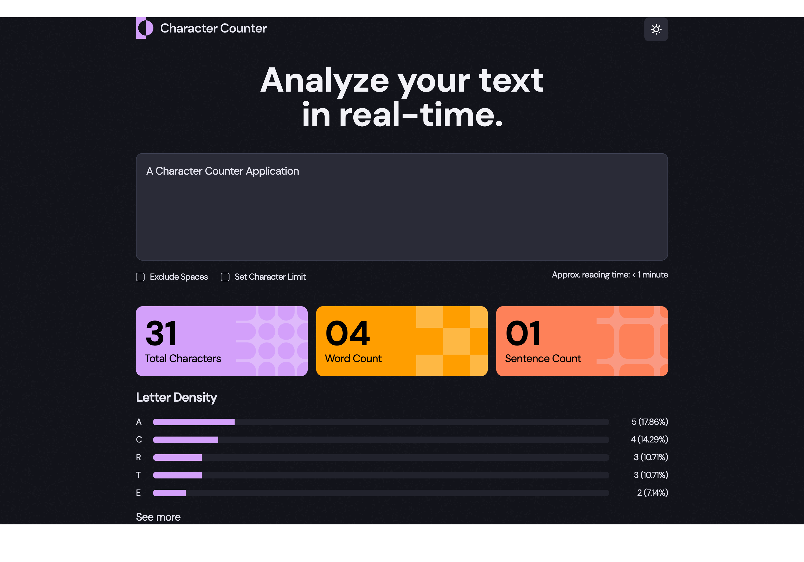

# Frontend Project Collection

A collection of my frontend projects. `Cmd + Click` (or `Ctrl + Click` on Windows) to open them in new tabs.

 

## 2. Character Counter App

An interactive React application offering real-time analysis of user input.

**Key Concepts**:

- State management
- Controlled input
- Dark/light theme
- Collapsible list

 

🔗 [Repository](https://github.com/Nimus-oes/react-character-counter)  
🔗 [Live Demo](https://nimus-oes.github.io/react-character-counter/)  
🔗 [Blog Article](https://nimus.hashnode.dev/character-counter-app-frontend-project-2)

 

## 1. Contact Form

A static contact form page built with HTML, CSS, and React.

**Key Concepts**:

- Static page rendering
- `rem` for enhanced accessibility
- Flexbox layout

 

🔗 [Repository](https://github.com/Nimus-oes/react-static-contact-form)  
🔗 [Live Demo](https://nimus-oes.github.io/react-static-contact-form/)  
🔗 [Blog Article](https://nimus.hashnode.dev/contact-form-fe-project-1-1)
